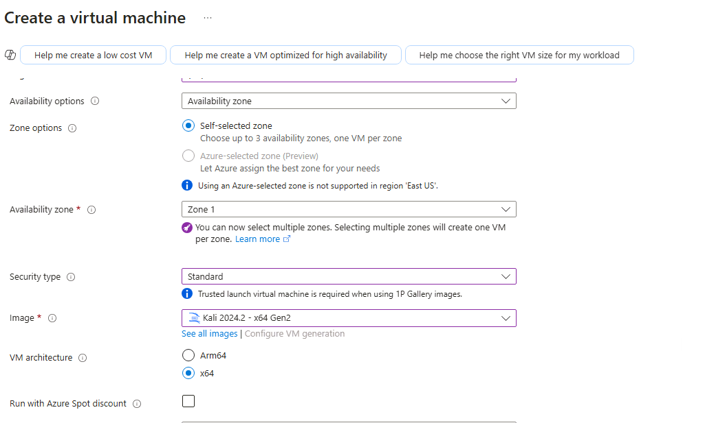
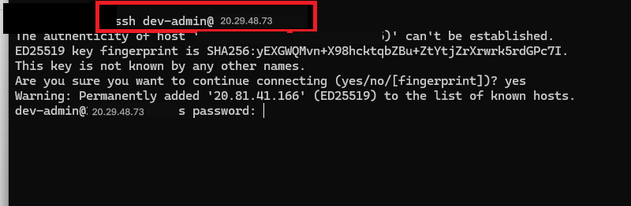
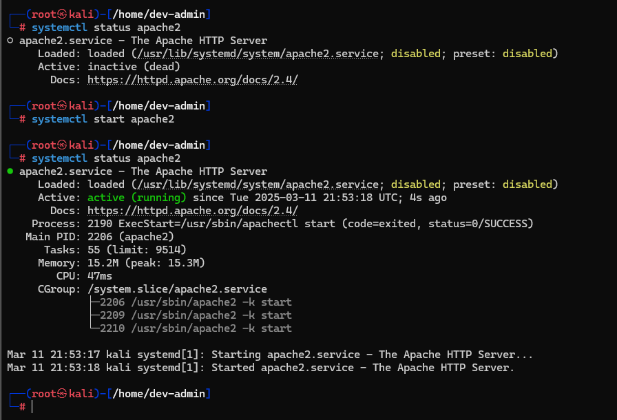
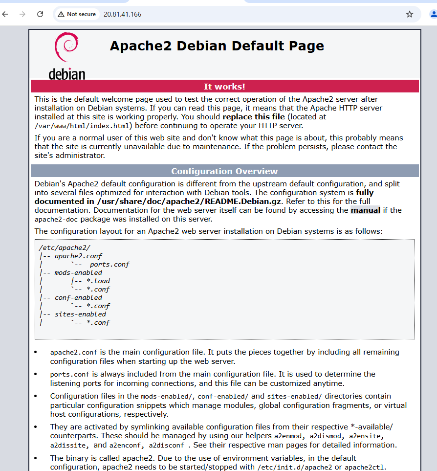
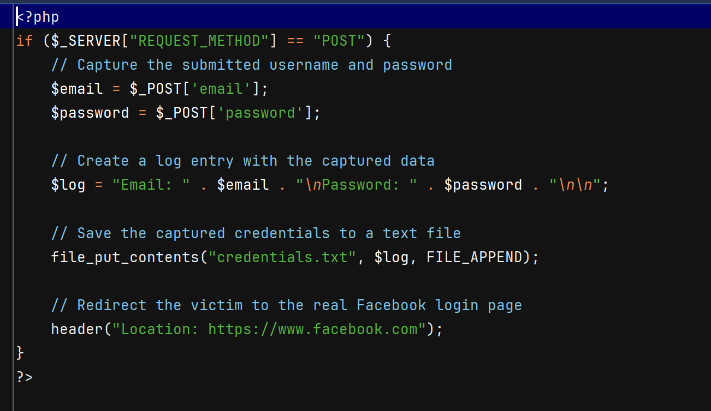

## Phishing Awareness Environment

### Table of Contents
1. [Disclaimer](#disclaimer)
2. [Project Overview](#project-overview)
3. [Setup Instructions](#setup-instructions)
   - [Step 1: Create a Kali Linux VM in Azure](#step-1-create-a-kali-linux-vm-in-azure)
   - [Step 2: Connect via SSH](#step-2-connect-via-ssh)
   - [Step 3: Install Web Server and PHP](#step-3-install-web-server-and-php)
   - [Step 4: Deploy the Awareness Page](#step-4-deploy-the-awareness-page)
   - [Step 5: Test the Page](#step-5-test-the-page)
   - [Step 6: Verify the URL](#step-6-verify-the-url)
4. [Ethical Considerations](#ethical-considerations)

---

### Disclaimer
**⚠️ Ethical Use Only**  
This project is intended for **educational purposes only** and must be used in controlled environments **with explicit permission**. Unauthorized use of this tool to collect credentials is illegal and violates GitHub policies. The goal is to **raise awareness about phishing attacks** and help organizations train users against social engineering threats.  

---

## Project Overview
This repository provides a **phishing awareness lab** by setting up a Kali Linux VM with an Apache web server, simulating a phishing login page in Azure.

---

## Setup Instructions

### Step 1: Create a Kali Linux VM in Azure

1. **Login to Azure** and create a **Virtual Machine (VM)**.  
2. **Set up the VM with the following configurations:**
   - **VM Name**: Test-Server01
   - **Image**: Kali Linux
   - **Region**: Central US (or your preferred region)
   - **Authentication**: Password
   - **Username**: `dev-admin`
   - **Password**: `Pa$$w0rd1234`
   - **Inbound Ports**: Open ports 80 (HTTP) and 22 (SSH)
    ---
    **It’s usually not a good security practice to allow ports immediately. In cloud environments, it's best to first create a VPC/VNet, define a Security Group with strict rules, and then create the VM while assigning it to the VNet and Security Group for better security. However, since we are creating this VM purely for learning phishing simulation, we are allowing ports 22 and 80 for accessibility, but this is not a best practice in a real-world environment.**

    ---
       **Fig-1 - VM-Security type, Image**


    ---
     **Fig-2 - VM- Username, Password, Inbound ports**
---
3. **Create and deploy the VM.**
4. **Note the Public IP** of the VM (e.g., `20.29.48.73`).
       
**Fig-3 - VM- Username, Password, Inbound ports**
---

### Step 2: Connect via SSH

```sh
ssh dev-admin@20.29.48.73
```
 **Fig-4 - SSH connection from Windows machine via using cmd**
```sh
sudo su  # Switch to root
```

---

### Step 3: Install Web Server and PHP

```sh
apt update
```
```sh
sudo apt install apache2 -y
```
```sh
sudo systemctl start apache2
```
 **Fig-5 - install Apache**

**Installing php - for running php file (loginCaputre.php)** 
```sh
sudo apt install php -y # install PHP
```
```sh
sudo php -v         # check PHP Version
```
---

### Step 4: Deploy the Awareness Page

```sh
cd /var/www/html/
```
**This location can access the index.html file, which is the default Apache web page** 
 **Fig-6 - Apache web page**
```sh
rm index.html # Remove default apache webpage
```
```sh
nano index.html  # Create the login page
```
 **Fig-7 - index.html**

```sh
nano loginCapture.php  # PHP script to log data and sending to file credentials.txt
```
 **Fig-8 - loginCapture.png**

```sh
nano credentials.txt  # Store captured logins
```

Set permissions:
```sh
chmod 777 index.html loginCapture.php credentials.txt
```

---

### Step 5: Test the Page

1. Open a browser and visit:
   ```
   http://<public-ip>/
   ```
2. Enter test credentials (e.g., `test@gmail.com`, `password1234`).
3. View the stored credentials:
   ```sh
   cat /var/www/html/credentials.txt
   ```

---

### Step 6: Verify the URL
- **Check the URL Format** – Legitimate sites typically use domain names, not just IP addresses. If a domain is used, ensure it's a well-known website with a good reputation. Attackers often hide malicious URLs using **URL shorteners** (**e.g., Bitly, TinyURL, ShortURL**) to bypass security measures and trick victims. Always verify **shortened URLs** before clicking. 
- **Look for HTTPS** – No SSL/TLS means it's less secure. 

- Use Security Tools:  

    -  Google Safe Browsing 
    - VirusTotal – Scans for malware and phishing. 
    - URLScan.io – Analyzes website behavior and reputation. 
    - Check Shortened Links – Expands and analyzes shortened URLs. 

---

## Ethical Considerations
- This project **must not be used for unauthorized phishing attempts**.
- Always obtain **written permission** before using in an organization.
- Use for **security awareness training** only.

---


