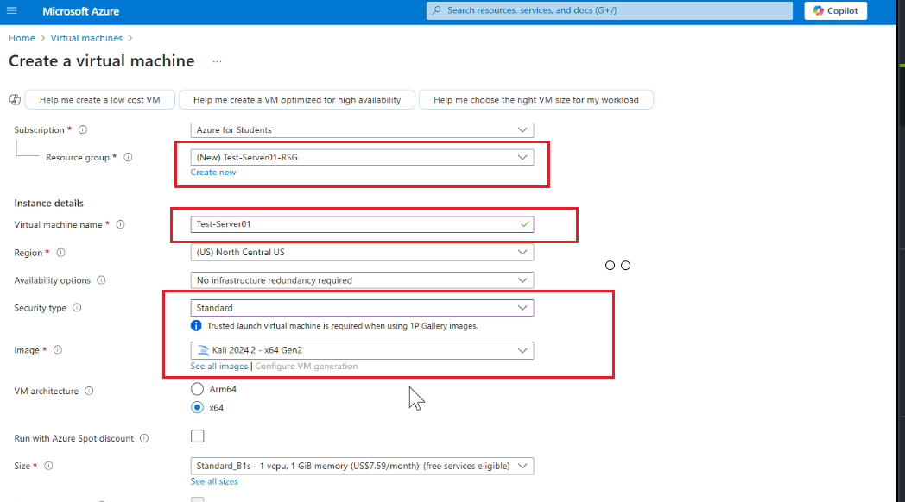
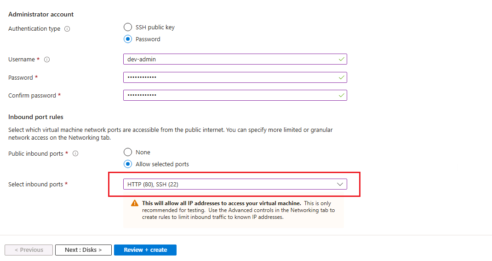
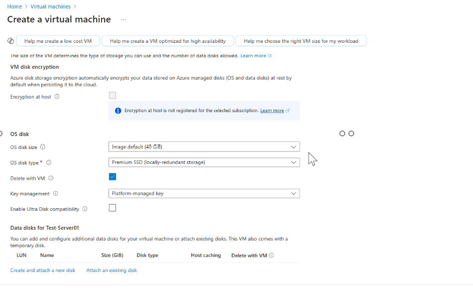
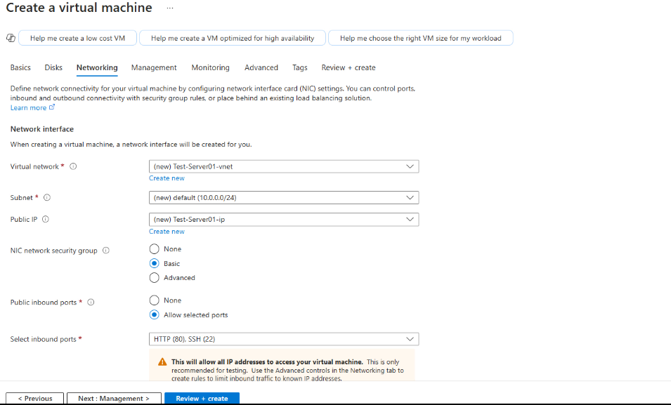
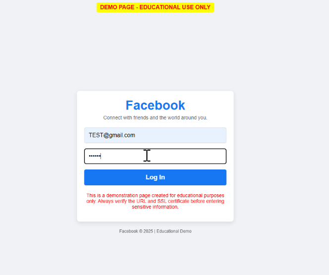

## Phishing Awareness Environment

### Table of Contents
1. [Disclaimer](#disclaimer)
2. [Project Overview](#project-overview)
3. [Setup Instructions](#setup-instructions)
   - [Step 1: Create a Kali Linux VM in Azure](#step-1-create-a-kali-linux-vm-in-azure)
   - [Step 2: Connect via SSH](#step-2-connect-via-ssh)
   - [Step 3: Install Web Server and PHP](#step-3-install-web-server-and-php)
   - [Step 4: Deploy the Awareness Page](#step-4-deploy-the-awareness-page)
   - [Step 5: Test the Page](#step-5-test-the-page)
   - [Step 6: Verify the URL](#step-6-verify-the-url)
4. [Ethical Considerations](#ethical-considerations)

---

### Disclaimer
**⚠️ Ethical Use Only**  
This project is intended for **educational purposes only** and must be used in controlled environments **with explicit permission**. Unauthorized use of this tool to collect credentials is illegal. The goal is to **raise awareness about phishing attacks** and help organizations train users against social engineering attacks.  

---

## Project Overview
This repository provides a **phishing awareness lab** by setting up a Kali Linux VM with an Apache web server, simulating a phishing login page in Azure.

---

## Setup Instructions

### Step 1: Create a Kali Linux VM in Azure

1. **Login to Azure** and create a **Virtual Machine (VM)**.  
2. **Set up the VM with the following configurations:**
   - **VM Name**: Test-Server01
   - **Resource Group**: Test-Server-RSG  
      - **create one if required**
   - **Security type**: Standard      
   - **Image**: Kali Linux
   - **Region**: Central US (or your preferred region) 

       ---  
      <p align="center">
      
      <br><b>Fig-1 - VM-initial config, Security type, Image</b>
      </p>
   - **Authentication**: Password
   - **Username**: `dev-admin`
   - **Password**: `Password1234`
   - **Inbound Ports**: Open ports 80 (HTTP) and 22 (SSH)

      ---
      **It’s usually not a good security practice to allow ports immediately. In cloud environments, it's best to first create a VPC/VNet, define a Security Group with strict rules, and then create the VM while assigning it to the VNet and Security Group for better security. However, since we are creating this VM purely for learning phishing simulation, we are allowing ports 22 and 80 for accessibility, but this is not a best practice in a real-world environment.**

      ---
      <p align="center">
      
      <br><b>Fig-2 - VM- Username, Password, Inbound ports</b>
      </p>
    
   ---

3. **Disk**
      - **Using default settings**: Feel free to modify as needed for basic     requirements. 
      ---
      <p align="center">
      
      <br><b>Fig-3 - VM- Username, Password, Inbound ports</b>
      </p> 
4. **Networking:**
      - **Virtual network**: Test-Server01-vnet - This is the default option provided by Azure Cloud (feel free to create a new VNet if needed).
      - **Subnet**: Using the Default option
      - **Public IP**: Using Default option - if no default option is available, create a new one.
      - **Note**: These are not best practices for setting up a VM. Always follow best practices by creating the VNet, subnet, resource group, and NSG first, then create the VM and apply all necessary settings to ensure security and proper configuration.
      ---
      <p align="center">
      
      <br><b>Fig-4 - Networking-Virtual Network, Subnet, Public IP</b>
      </p> 

5. **Management, Advanced, Tags**: not modifying, leave the default settings and proceed to the next step.
6. **Create and deploy the VM.**: Go to the resources to verify the VM (Test-Server01). 
7. **Note the Public IP** of the VM (e.g., `20.29.48.73`).
      <p align="center">
      
      <br><b>Fig-5 - VM-Disk size, Disk type</b>
      </p> 

---

### Step 2: Connect the VM (Test-Server01) via SSH
- **Open command prompt(Windows)/teminal(Linux)**: Using any machine (Windows or Linux) 
   - Go to terminal or CMD 
   - Type **ssh username@ipaddress**
   - **Are you sure you want to continue connecting**: Type **yes**  
   -**password**: Enter password 

   ```sh
   ssh dev-admin@20.29.48.73
   ```
   <p align="center">
   
   <br><b>Fig-6 - SSH connection from Windows machine via using cmd</b>
   </p> 

- **Switch to root** 
   ```sh
   sudo su  
   ```

---

### Step 3: Install Web Server and PHP
- **Login as root**: make sure to switch as a root. If not, use the sudo before command.

   ```sh
   apt update
   ```
- **Install apache2**:  Installing the web server (Apache2) to host a webpage and run it.
   ```sh
   sudo apt install apache2 -y
   ```
- **Start apache2**: Start the Apache web server and check its status.
   ```sh
   sudo systemctl start apache2
   ```
    ```sh
   sudo systemctl status apache2
   ```
   <p align="center">
   
   <br><b>Fig-5 - install Apache</b>
   </p> 

- **Installing php - for running php file (loginCaputre.php)** 
   ```sh
   sudo apt install php -y 
   ```
- **Verify PHP**
   ```sh
   sudo php -v         
   ```
   ---

### Step 4: Deploy the Awareness Page
- **This location can access the index.html file, which is the default Apache web page** 
   <p align="center">
   
   <br><b>Fig-6 - Apache web page</b>
   </p> 
- **Apache web page locaiton**:
   ```sh
   rm index.html 
   ```
- **Create the login page**: Creating a fake page
   ```sh
   nano index.html 
   ```

   <p align="center">
      
      <br><b>Fig-7 - index.html</b>
   </p> 

- **Creating a PHP script to capture username and Email data and sending to file credentials.txt**
   ```sh
   nano loginCapture.php  
   ```
   <p align="center">
   
   <br><b>Fig-8 - loginCapture.png</b>
   </p>

- **Store captured logins in credentials.txt file**

   ```sh
   touch credentials.txt  
   ```

- **Set permissions**: 
   ```sh
   chmod 777 index.html loginCapture.php credentials.txt
   ```

---

### Step 5: Test the Page

1. Open a browser from anywhere and visit:
   ```
   http://<public-ip>/

   ```
2. Enter test credentials (e.g., `test@gmail.com`, `password1234`).

   <p align="center">
   
   <br><b>Fig-8 - loginCapture.png</b>
   </p>

- There are many ways to **hide** a fake HTTP address, such as using **URL shorteners** to create an HTTPS link. This can bypass spam filters and lead users to fake websites designed to steal credentials.
   ⚠️ Be Aware: fake page on http://<public-IP> to demonstrate how attackers can trick users. Hackers don’t just rely on these techniques — they often build **real and fake websites to lure victims into phishing attempts**. Always verify links before clicking and double-check URLs, especially from unfamiliar sources.

3. View the stored credentials: Go back to terminal & type **cat credentials.txt**
   ```sh
   cat credentials.txt
   ```

---

### Step 6: Verify the URL
- **Check the URL Format** – Legitimate sites typically use domain names, not just IP addresses. If a domain is used, ensure it's a well-known website with a good reputation. Attackers often hide malicious URLs using **URL shorteners** (**e.g., Bitly, TinyURL, ShortURL**) to bypass security measures and trick victims. Always verify **shortened URLs** before clicking. 
- **Look for HTTPS** – No SSL/TLS means it's less secure. 

- Use Security Tools:  

    -  Google Safe Browsing 
    - VirusTotal – Scans for malware and phishing. 
    - URLScan.io – Analyzes website behavior and reputation. 
    - Check Shortened Links – Expands and analyzes shortened URLs. 

---

## Ethical Considerations
- This project **must not be used for unauthorized phishing attempts**.
- Always obtain **written permission** before using in an organization.
- Use for **security awareness training** only.

---


